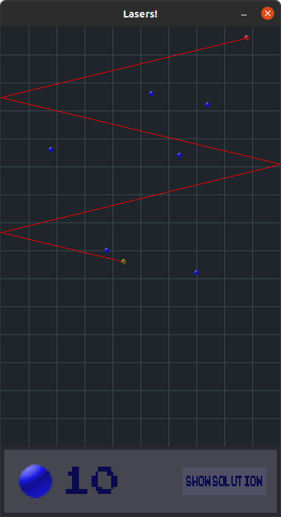

# Lasers!
“Lasers!” is without the shadow of a doubt, the best game ever written.
Just feast your eyes upon this magnificient screenshot,



A sniper is aiming at you with a laser, inside a room covered with
 mirrors (mondays, uh). Luckily, you have up to 16 blue obstacles at
  your disposal to block the laser. Will you be able to do it?

  # Installation

Install the necessary dependences, `libsdl2-2.0-0`, 
`libsdl2-image-2.0-0`,
and `libsdl2-ttf-2.0-0`. On Debian based distributions,
```shell
$ sudo apt update
$ sudo apt install libsdl2-2.0-0\
  libsdl2-image-2.0-0\
  libsdl2-ttf-2.0-0
```
  Clone this repository, configure, make, and make install,
  ```shell
$ git clone https://github.com/sbacco/Lasers.git
$ cd Lasers
$ ./configure
$ make
$ sudo make install
  ```
You can now run `Lasers!`,
```shell
$ lasers
```

# Todo list

- [ ] Add an in-depth documentation, where I go into all of the
      interesting mathematical details.
- [ ] Fix bug when an obstacle has to be placed over the shooter.
      Maybe avoid the situation entirely?
- [ ] Figure out a way to compute the maximum number of bounce-offs
      that will be needed, to make computations faster.
- [ ] Implement nicer behavior when the player tries to put an obstacle
      onto an existing object (right now, it systematically goes to
      the right).
- [ ] Have some pretty mouse pointers to go with the game.
